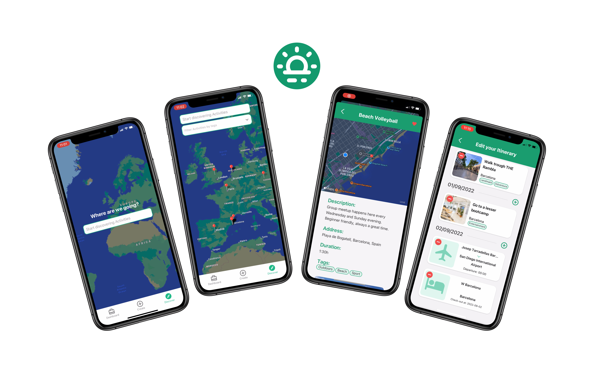

# Trepir

## Where to?

DESCRIPTION

<p align="center">
  
</p>

## Developed with...

<a style="margin:10px;" href="https://reactnative.dev/" target="_blank" rel="noreferrer"></a>
<a style="margin:10px;" href="https://expo.dev/" target="_blank" rel="noreferrer"></a>
<a href="https://nativebase.io/" target="_blank" rel="noreferrer"></a>

- **React Navigation** - Routing and navigation for React Native apps
- **Expo** - Build cross-platform native apps
- **Native Base** - Styled component for React Native apps

## Getting started

1. Clone the repo

```
git clone https://github.com/RomelClavel/trepir-mobile.git
cd trepir-mobile
```

2. Install dependencies

```
npm install
```

1. Fill out your API keys

```

```

4. Do BE KEYS

```
DATABASE_URL="CONNECTION_URL"
SECRET_JWT_SEED=YOUR_SUPPER_SECRET_JWT_SEED
```

5. Start development server

```
npx expo start
```

6. Scan the barcode with the Expo app on your phone or follow the terminal instructions to load up the emulator on your machine.

## What makes Chartrip Different

- ### Fully Developed in React Native with Expo
  - Able to work on both Android and iOS.
  - Can access every hardware functionality on your phone for a better experience.
  - Create an account once on your phone and always be logged in.
- ### FEATURE

- ### FEATURE

### Coming soon to AppStore and Play Store...
